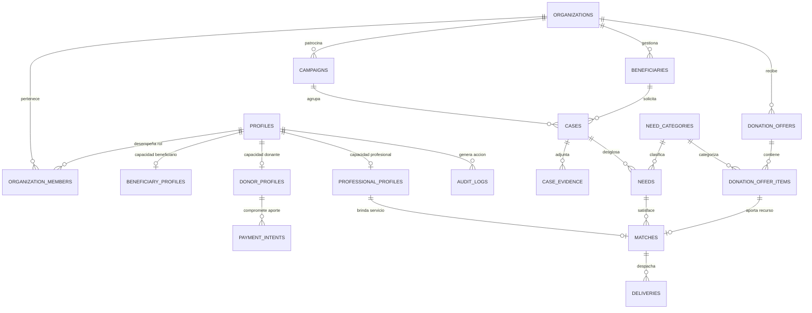

# Diagrama y Modelo de Datos: EMDECOB Solidaria

## Diagrama Entidad-Relación (Mermaid)

## Especificación de Tablas Principales
1. `geo_departments` (code [PK], name)
2. `geo_municipalities` (code [PK], department_code [FK], name) - Códigos oficiales DANE.
3. `organizations` (id [PK], name, nit, active)
4. `organization_members` (id [PK], organization_id [FK], user_id [FK], role ['superadmin', 'org_admin', 'coordinator', 'operator', 'auditor'])
5. `profiles` (id [PK auth.users], email, full_name, phone_encrypted)
6. `beneficiary_profiles` (id [PK], user_id [FK NULLABLE], beneficiary_code, family_members_count)
7. `donor_profiles` (id [PK], user_id [FK], donor_type ['individual', 'company'], public_display_consent)
8. `professional_profiles` (id [PK], user_id [FK], profession, specialty, license_number, max_weekly_hours)
9. `campaigns` (id [PK], organization_id [FK], title, description, department_code, municipality_code, active)
10. `beneficiaries` (id [PK], organization_id [FK], beneficiary_user_id [FK NULLABLE], document_hmac, encrypted_document_number, full_name)
11. `cases` (id [PK], public_code [UNIQUE > 8 chars], organization_id [FK], campaign_id [FK], beneficiary_id [FK], urgency_level, status)
12. `needs` (id [PK], case_id [FK], organization_id [FK], category_id [FK], type, quantity_required numeric, quantity_fulfilled numeric, estimated_value_cop numeric(14,2), status)
13. `matches` (id [PK], organization_id [FK], need_id [FK], resource_type ['donation', 'professional'], donation_offer_item_id [FK], professional_id [FK], quantity_assigned numeric, CHECK single source constraint)
14. `deliveries` (id [PK], organization_id [FK], match_id [FK], quantity_delivered numeric, confirmed_by_beneficiary, beneficiary_rating)
15. `audit_logs` (id [PK], actor_id, organization_id, action, target_entity, target_id, payload_sanitized JSONB, created_at) - INSERT-ONLY.
